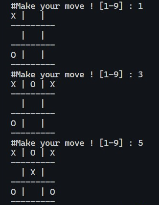

# Tic-Tac-Toe
### Description
Tic-tac-toe is a very popular game, so let’s implement an automatic Tic-tac-toe game using Python.<br>
The game is automatically played by the program and hence, no user input is needed. Still, developing<br>
a automatic game will be lots of fun. Let’s see how to do this.

### Tools and Languages:


<br>

### Installing Libraries
```cmd
pip install sys
pip install random
```
-> Mostly probably you should already have OS. datetime, time and random libraries installed as it comes with python distribution.

### Steps to follow
-Install the given libraries<br>
-Download the code from the given github repository<br>
-Save your desired video link in file
-Run the code<br>

### Breaking the code
Importing libraries
```python
import random
import sys
```

Defining Variables. board variable contains number that are actually the grid numbers of the game.<br>
```python
board=[i for i in range(0,9)]
player, computer = '',''
moves=((1,7,3,9),(5,),(2,4,6,8))
winners=((0,1,2),(3,4,5),(6,7,8),(0,3,6),(1,4,7),(2,5,8),(0,4,8),(2,4,6))
tab=range(1,10)
```

This function, print_board(), creates the board or the basic layout of the game.
```python
def print_board():
    x=1
    for i in board:
        end = ' | '
        if x%3 == 0:
            end = ' \n'
            if i != 1: end+='---------\n';
        char=' '
        if i in ('X','O'): char=i;
        x+=1
        print(char,end=end)
```

This functions just lets you select the character 'X' or 'O'.
```python
def select_char():
    chars=('X','O')
    if random.randint(0,1) == 0:
        return chars[::-1]
    return chars
```

This functions checkes if the desired move is possible or not.
```python
def can_move(brd, player, move):
    if move in tab and brd[move-1] == move-1:
        return True
    return False
```

This functions checks if the user has already won with the previous moves.
```python
def can_win(brd, player, move):
    places=[]
    x=0
    for i in brd:
        if i == player: places.append(x);
        x+=1
    win=True
    for tup in winners:
        win=True
        for ix in tup:
            if brd[ix] != player:
                win=False
                break
        if win == True:
            break
    return win
```

make_move() function takes the move and remembers it. It also prints the choices in next board print.
```python
def make_move(brd, player, move, undo=False):
    if can_move(brd, player, move):
        brd[move-1] = player
        win=can_win(brd, player, move)
        if undo:
            brd[move-1] = move-1
        return (True, win)
    return (False, False)
```

This functions is invoked automatically after the user choice to let the random computer choice.
```python
def computer_move():
    move=-1
    for i in range(1,10):
        if make_move(board, computer, i, True)[1]:
            move=i
            break
    if move == -1:
        for i in range(1,10):
            if make_move(board, player, i, True)[1]:
                move=i
                break
    if move == -1:
        for tup in moves:
            for mv in tup:
                if move == -1 and can_move(board, computer, mv):
                    move=mv
                    break
    return make_move(board, computer, move)
```

Returns if the board is complete or not.
```python
def space_exist():
    return board.count('X') + board.count('O') != 9
```

This is the main driving code of the game.
```python
player, computer = select_char()
print('Player is [%s] and computer is [%s]' % (player, computer))
result='%%% Deuce ! %%%'
while space_exist():
    print_board()
    print('#Make your move ! [1-9] : ', end='')
    move = int(input())
    moved, won = make_move(board, player, move)
    if not moved:
        print(' >> Invalid number ! Try again !')
        continue
    if won:
        result='*** Congratulations ! You won ! ***'
        break
    elif computer_move()[1]:
        result='=== You lose ! =='
        break;
print_board()
print(result)
```

### Sample Output

